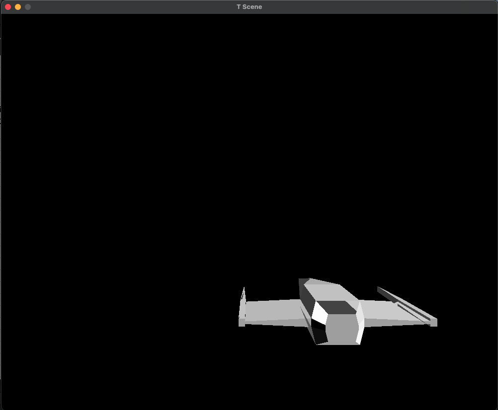

<div align="center">
    

  <h3 align="center"><strong>CrustEngine</strong><br/>Simple engine rendering 3D files using 2D renderer SDL2.</h3>

  <p align="center">
    <a href="https://github.com/KarolBorecki/CrustEngine/commits/main">Commits</a>
    ·
    <a href="https://github.com/KarolBorecki/CrustEngine/branches">Branches</a>
    ·
    <a href="https://github.com/KarolBorecki/CrustEngine/issues">Issues</a>
  </p>
</div>

## Project description

Project's goal is to make simple 3D engine using basic 2D drawer library (Right now using SDL 2.0) in C++ 17. Project is being developed since October 2022 and was my first approach to creating 3D projection. 

## Usage
Project is using technologies passed below:
- C++ 17
- SDL 2.0
- Deoxygen (With doxygen-awesome-css input)

Tools Used by me to develop it:
- Atom/VS Code - IDE software
- G++ - C++ compiler

Also I am using wavefront's obj standard as a standard 3D model file.

## Requirements
Here are listed basic requirements for this project:
- Using only simple SDL2 methods (Window creating and line drawing). It might extend as the project grows.
- Support for at least one 3D file (*.obj).
- Possibility to change camera perspective and field of view.
- Easy compilation process and usage (No need for external installation processes).
- Fully documented project using deoxygen.
- Everything written by hande (No code generations).

More detailed were written outside of this repository and will be added later.

## Compilation using g++
Inside CrustEngine folder run command:
```
make engine
```
If no errors occured run:
```
./engine.out
```
As an argument You are ought to pass the starting mesh (*.obj) file, that will be loaded from `CrustEngine/Tmp/meshes` folder. 

*Example for VideoShip.obj: `./engine.out VideoShip`*

## Documentation

I am documenting this project using deoxygen software. The setting and compiled documentation is placed inside `CrustDoc/` folder. I encourage You to open HTML output and read the documentation. I try to keep it as current as possible by compiling it often, but until first beta release I would advise You to use documentation placed inside the code. 

## CrustEngine screenshot
Here is example of how it looks like now.


## CrustEngine's test framework
During development of this project I came across the choice of an c++ testing framework. As c++ does not offer very much support for testing (unlike java, which is compiled to byte-code and can be quicjly tested) and as I did not required much from this framwework I decided to create my own. It is placed inside  `CrustTestingFramework` folder and is as simple as possible. Feel free to use it.

## Contact

If You have any questions You can contact be directly.
